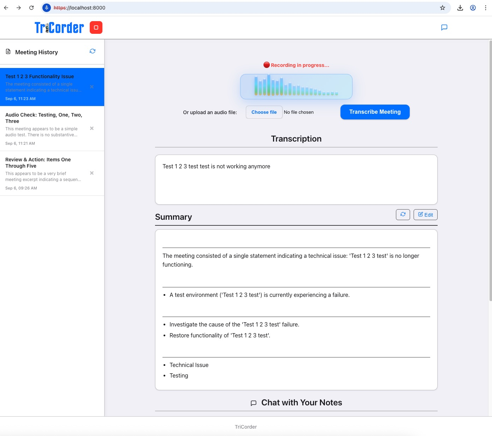
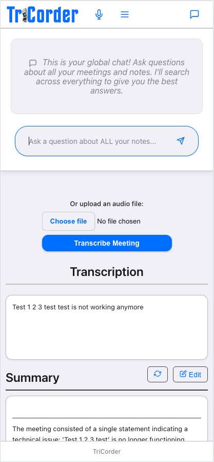

# TriCorder

This is a unified FastAPI application that allows you to record or upload audio, get a transcription, and then generate an AI-powered summary of the conversation. You can also chat with your notes to ask questions and find information from past meetings.

## Features

*   **Audio Transcription:** Record audio directly from your browser or upload an audio file. The backend uses `faster-whisper` for fast and accurate transcription.
*   **AI Summarization:** Get a detailed summary of your transcription, including key points, action items, and categories. This is powered by a local `ollama` instance running a model like Gemma.
*   **Vector Database:** All transcriptions and summaries are stored in a `ChromaDB` vector database, allowing for powerful semantic search.
*   **Chat with Your Notes:** A chat interface allows you to ask questions about your meetings. The AI will use the information in the vector database to answer your questions and provide sources.
*   **Meeting Management:** View, edit, and delete your past meetings.
*   **Local First:** All components (transcription, summarization, database) run locally, ensuring your data stays private.

**Note:** The app has been tested against gpt-oss:20b and gemma3:12b. It appeared that gpt-oss:20b performed slightly better but requires better GPU resources to run locally and is slower.

## Screenshots

### Desktop View


### Mobile View


*TriCorder running on desktop and mobile devices, showing the unified interface for audio transcription and AI-powered meeting summaries.*

## How it Works

TriCorder is a unified FastAPI application that serves both the web interface and API endpoints from a single server.

### Architecture

The application combines frontend and backend functionality in a single FastAPI server:

1.  **Web Interface:** The frontend is built with vanilla HTML, CSS, and JavaScript, served directly by FastAPI's static file mounting.
2.  **API Endpoints:** FastAPI handles all the core logic through REST endpoints.
3.  **Static Assets:** CSS, JavaScript, and images are served from the `/static` path.

### Core Functionality

The FastAPI application handles all operations:

1.  **Transcription:** The `/transcribe` endpoint receives an audio file, saves it temporarily, and uses the `faster-whisper` model to generate a transcription.
2.  **Summarization:** The `/summarize` endpoint receives the transcription text. It uses a prompt to instruct an `ollama` model to generate a JSON object containing a summary, key points, action items, and categories.
3.  **Data Storage (ChromaDB) & Semantic Search:**
    *   When a summary is generated, a new "meeting" is created. The meeting's details (title, summary, etc.) and its full transcription are stored in a `meetings` collection in ChromaDB.
    *   The full transcription is also broken down into smaller, overlapping chunks. Each chunk is converted into a vector embedding using the `all-MiniLM-L6-v2` sentence transformer model and stored in a `notes` collection in ChromaDB.
    *   **Vector Embeddings:** `all-MiniLM-L6-v2` transforms text into 384-dimensional numerical vectors that capture semantic meaning, enabling intelligent similarity-based search rather than simple keyword matching.
    *   **Semantic Search:** When you ask questions, your query is converted to a vector and ChromaDB finds the most semantically similar stored chunks, allowing the AI to provide contextually relevant answers.
4.  **Chat Logic:** The `/chat` endpoint receives a user's question.
    *   It creates an embedding of the question.
    *   It queries both the `meetings` collection (for high-level summaries) and the `notes` collection (for specific details from the transcription) in ChromaDB to find the most relevant context.
    *   It combines the user's question with the retrieved context into a prompt for the `ollama` model.
    *   The model generates a response, which is sent back to the frontend along with the sources that were used to generate the answer.

## Installation and Setup

1.  **Clone the repository:**
    ```bash
    git clone <repository-url>
    cd <repository-directory>
    ```

2.  **Install Python dependencies:**
    ```bash
    pip install -r requirements.txt
    ```

3.  **Install Ollama:**
    Follow the instructions on the [Ollama website](https://ollama.ai/) to install and run Ollama on your machine.

4.  **Pull the Ollama model:**
    This application uses the `gemma3:12b` model by default (configured in `.env`). You can pull it by running:
    ```bash
    ollama pull gemma3:12b
    ```

5.  **Configure the `.env` file:**
    The `.env` file contains all the configuration settings. Edit it to customize your setup:

    ```bash
    # Server Configuration
    HOST_IP=192.168.1.35          # IP address for the server
    BACKEND_PORT=8000             # Port for the unified FastAPI server

    # LLM Configuration
    OLLAMA_MODEL=gemma3:12b       # LLM model to use (default: gemma3:12b)
    OLLAMA_HOST=http://localhost:11434  # Ollama server URL

    # SSL Certificates
    SSL_KEY_PATH=key.pem          # Path to SSL key file
    SSL_CERT_PATH=cert.pem        # Path to SSL certificate file
    ```

    **Configuration Notes:**
    - `HOST_IP`: Set this to your local IP address (run `ip addr show` on Linux/Mac or `ipconfig` on Windows to find it)
    - `BACKEND_PORT`: The unified server port (default: 8000)
    - `OLLAMA_MODEL`: Change this to any Ollama model you have installed (e.g., `gemma3:4b`, `llama2:13b`)
    - `OLLAMA_HOST`: Usually `http://localhost:11434` unless you're running Ollama on a different machine
    - SSL paths are relative to the project root directory

6.  **Generate SSL Certificates:**
    The application uses HTTPS to enable audio recording in browsers. You'll need to generate a self-signed certificate.
    ```bash
    openssl req -x509 -newkey rsa:4096 -keyout key.pem -out cert.pem -sha256 -days 365 -nodes -subj "/C=US/ST=CA/L=San Francisco/O=MyCompany/OU=MyOrg/CN=192.168.1.35"
    ```
    **Important:** Replace `192.168.1.35` with the actual local IP address of the machine running the server.

    **Note on Self-Signed Certificates:** When using self-signed certificates, some browsers require the certificate on the backend server (port 8000) to be accepted. To do this, visit https://192.168.1.35:8000 once and accept the self-signed certificate.

    **Note:** This setup runs locally for development. In production, you should use proper SSL certificates from a trusted Certificate Authority and serve the application through a web server like Nginx or Apache for security and performance.

7.  **Run the application:**
    Start the unified FastAPI server that serves both the web interface and API:
    ```bash
    uvicorn main:app --host 192.168.1.35 --port 8000 --ssl-keyfile key.pem --ssl-certfile cert.pem
    ```

    **Alternative using Honcho:** If you prefer to use a process manager:
    ```bash
    pip install honcho
    honcho start
    ```

    This will start the server on `https://192.168.1.35:8000` (FastAPI with SSL serving both the web interface and API)

9.  **Access the application:**
    Open your browser and navigate to `https://192.168.1.35:8000`. You will need to accept the self-signed certificate warning in your browser.

    **Browser Recording Notes:** The HTTPS setup with SSL certificates is required to enable microphone access for recording in Safari and Chrome. Without HTTPS, these browsers block audio recording for security reasons.
